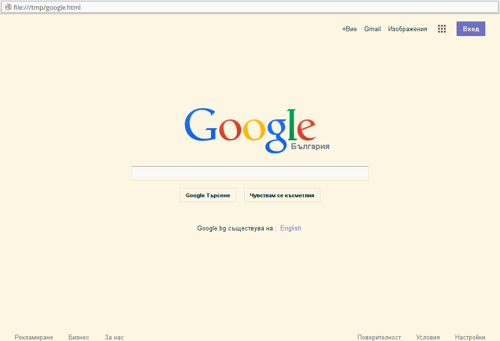

# Color Difference
Color class capable of transforming one color palette
to another automatically (can be used with CSS files).

The color matching is based on **Delta E (CIE76)**.

## Code examples
```ruby
require './color.rb'
require 'json'

# the constructor supports variety of color notations
color1 = Color.new('#00ff00')                 # #RRGGBB
color2 = Color.new('#0f0')                    # #RGB
color3 = Color.new('rgb(0, 255, 0)')          # rgb
color4 = Color.new('hsl(120, 100%, 50%)')     # hsl
color5 = Color.new('lime')                    # color names
color6 = Color.new('#00ff00ff')               # #RRGGBBAA
color7 = Color.new('#0f0f')                   # #RGBA
color8 = Color.new('rgba(0, 255, 0, 1)')      # rgba
color9 = Color.new('hsla(120, 100%, 50%, 1)') # hsla

# you could check that the above colors are all the same
1.upto(9)
  .map{ |i| eval "color#{i}" }
   .map{ |c| [c.r, c.g, c.b, c.a] }.uniq.size == 1

# let us define two colors
c_one = Color.new '#aaaafb'
c_two = Color.new '#9eeefb'

# let's get the color difference between them
c_one.diff(c_two)

# the order in which we calculate the difference doesn't matter
c_one.diff(c_two) == c_two.diff(c_one)

# how to transform a set of colors to the closest colors of another set
my_colors   = ['#7DF9FF', '#9ACD32', '#FF004F']
safe_colors = JSON.load File.read 'web-safe.json'
Color.transform_palette(my_colors, safe_colors)

# you could also get the color name of a color if that color has a name
color1.to_color_name # => "lime"

# getting the different color components
c_one.r # red   [0-255]
c_one.g # green [0-255]
c_one.b # blue  [0-255]
c_one.a # alpha channel [0.0-1.0]

c_one.light # color lightness [0.0-100.0]

```

### Here are some examples (the used colors are [Solarized](http://ethanschoonover.com/solarized)):




